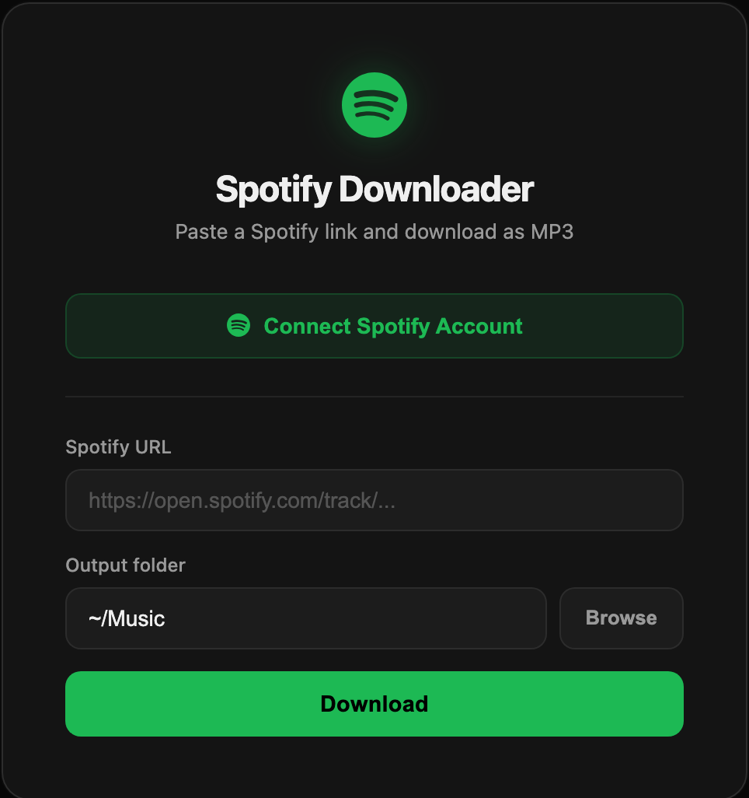
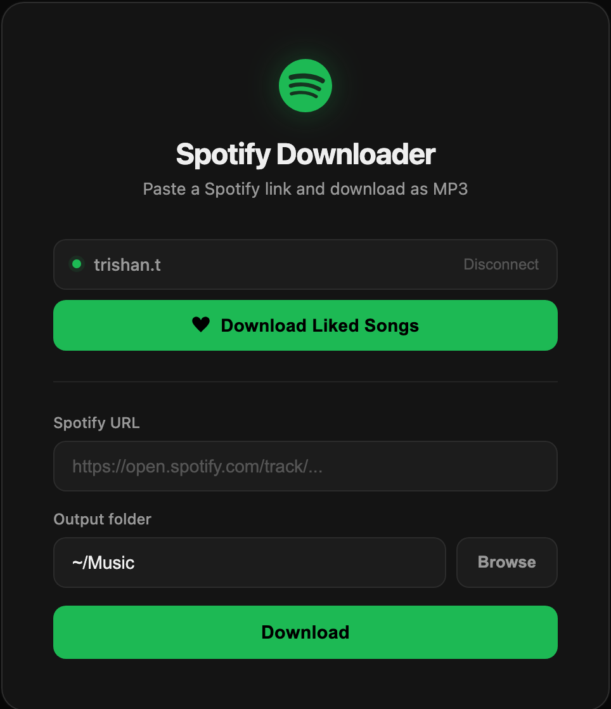
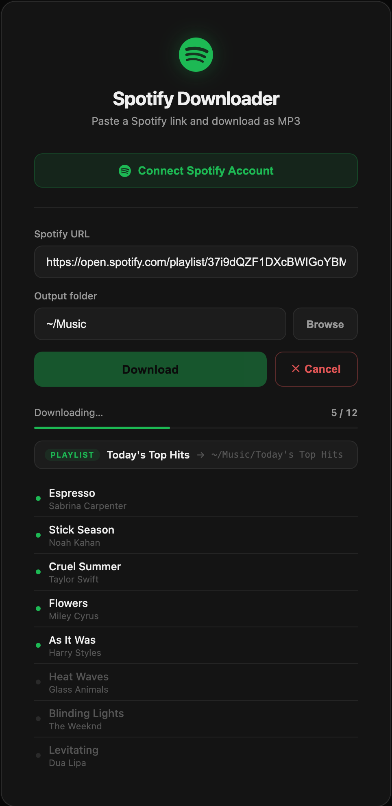
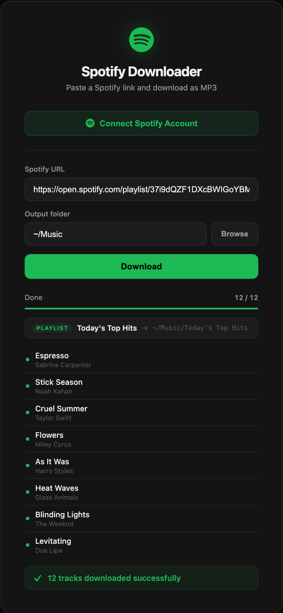
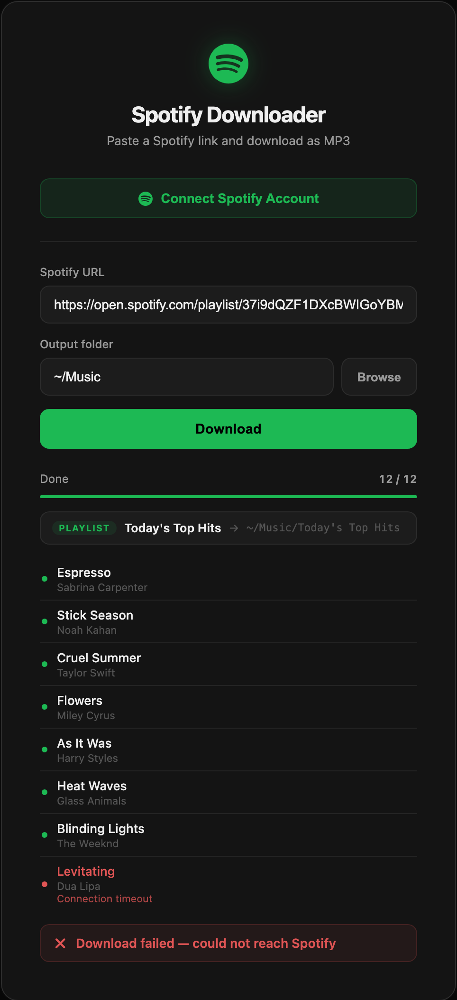
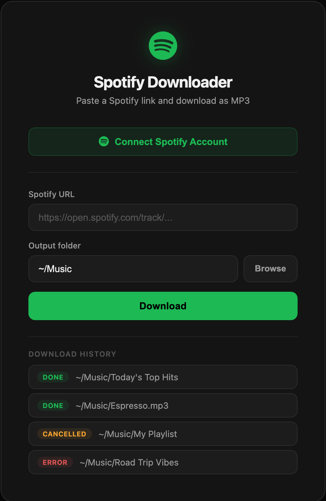

# Spotify Downloader

A Flask web app to download Spotify tracks, albums, and playlists as MP3s using [spotDL v4](https://github.com/spotDL/spotify-downloader).

No Spotify API credentials required — spotDL uses Spotify's public web API, finds the best match on YouTube, and converts to MP3 automatically.

  

---

## Features

- Paste any Spotify URL (track, album, artist, or playlist)
- Connect your Spotify account to download your **Liked Songs** library
- Choose your output folder with a native Finder picker
- Real-time download progress via Server-Sent Events
- Per-track status queue with live indicators
- Download history for the current session
- Clean dark UI with Spotify green accents

## Requirements

- Python 3.10+
- [Poetry](https://python-poetry.org/)
- [ffmpeg](https://ffmpeg.org/) (for audio conversion)

## Setup

```bash
# Install ffmpeg (macOS)
brew install ffmpeg

# Clone and install dependencies
git clone https://github.com/trishan023/spotify-downloader.git
cd spotify-downloader
poetry install --no-root

# Start the server
poetry run python app.py
```

Open http://localhost:8080 in your browser.

---

## UI Walkthrough

### 1 — Default view

Paste any Spotify link and hit **Download** — no account needed.



**Steps:**
1. Paste a Spotify track, album, artist, or playlist URL into the **Spotify URL** field.
2. The **Output folder** defaults to `~/Music`. Click **Browse** to open a native macOS Finder dialog and pick a different folder.
3. Click **Download**.

---

### 2 — Spotify account connected

Click **Connect Spotify Account** to authorise via OAuth. Once connected, the banner switches to show your account name and a one-click **Download Liked Songs** button.



- The **green dot** confirms the OAuth session is active.
- **Download Liked Songs** kicks off a full library download with no URL required.
- Click **Disconnect** to revoke the session.

---

### 3 — Download in progress

The progress bar, track counter, and a live per-track queue appear as soon as a job starts. Hit **Cancel** at any time to stop.



**Track dot colours:**

| Colour | Meaning |
|--------|---------|
| Dark grey | Pending — not started yet |
| Green (pulsing) | Actively downloading / converting |
| Solid green | Done |
| Red | Failed |

The strip below the progress bar shows the collection type (TRACK / ALBUM / PLAYLIST / ARTIST), its name, and the destination folder.

---

### 4 — Success

A green banner confirms how many tracks were downloaded.



---

### 5 — Error

If something goes wrong, a red banner shows the reason. Individual failed tracks are highlighted in the queue with an inline error message.



---

### 6 — Download history

Every completed job is logged at the bottom of the card for the current session, colour-coded by outcome.



---

## Project Structure

```
spotify-downloader/
├── app.py              # Flask app + API routes + SSE streaming
├── templates/
│   └── index.html      # Single-page UI
├── static/
│   ├── style.css       # Dark theme, Spotify green accents
│   └── script.js       # SSE progress handling, OAuth flow
├── docs/
│   └── screenshots/    # UI screenshots used in this README
└── pyproject.toml      # Poetry config
```

## Tech Stack

- **Flask** — web server
- **spotDL v4** — download engine (wraps yt-dlp + ffmpeg)
- **Vanilla JS** — no framework, SSE for real-time progress
- **Spotify OAuth** — optional account connection for Liked Songs
